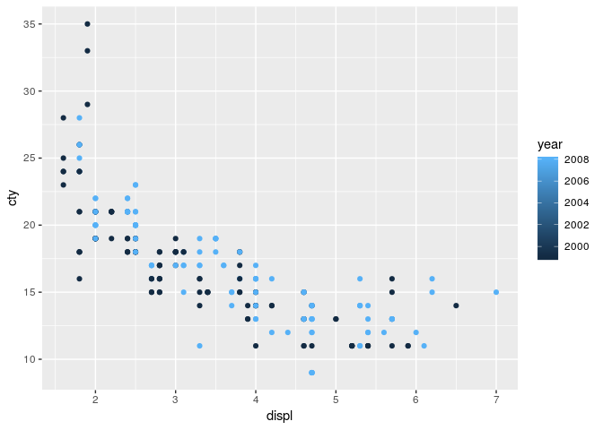
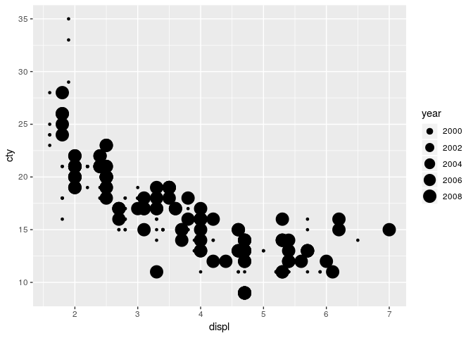
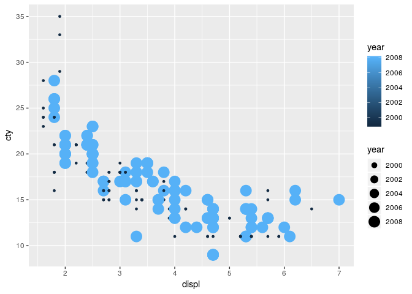
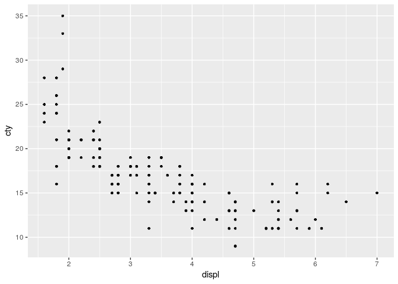
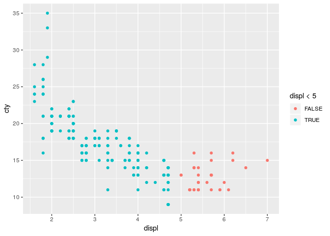

Homework 1: ggplot2
================
Anni Larin
2019-03-04

``` r
library(ggplot2)
```

By using *mpg* dataset:

1.  Map a continuous variable to color, size, and shape. How do these
    aesthetics behave differently for categorical vs. continuous
    variables?

<!-- end list -->

  - Color

<!-- end list -->

``` r
ggplot(data = mpg) + 
  geom_point(mapping = aes(x = displ, y = cty, color = year))
```

<!-- -->

  - Size

<!-- end list -->

``` r
ggplot(data = mpg) + 
  geom_point(mapping = aes(x = displ, y = cty, size = year))
```

<!-- -->

  - Shape. If shape=year, it is an error.

<!-- end list -->

``` r
ggplot(data = mpg) + 
  geom_point(mapping = aes(x = displ, y = cty, shape = class)) + 
  scale_shape_manual(values = 1:7)
```

<!-- -->

2.  What happens if you map the same variable to multiple aesthetics?

<!-- end list -->

``` r
ggplot(data = mpg) + 
  geom_point(mapping = aes(x = displ, y = cty, color = year, size = year))
```

<!-- -->

3.  What does the stroke aesthetic do? What shapes does it work with?
    (Hint: use ?geom\_point)

For shapes that have a border (like 21), you can colour the inside and
outside seperately. Use the stroke aesthetic to modify the width of the
border

``` r
ggplot(data = mpg) + 
  geom_point(mapping = aes(x = displ, y = cty, stroke = 0.1))
```

<!-- -->

4.  What happens if you map an aesthetic to something other than a
    variable name, like aes(colour = displ \< 5)?

<!-- end list -->

``` r
ggplot(data = mpg) + 
  geom_point(mapping = aes(x = displ, y = cty, color = displ < 5))
```

<!-- -->
